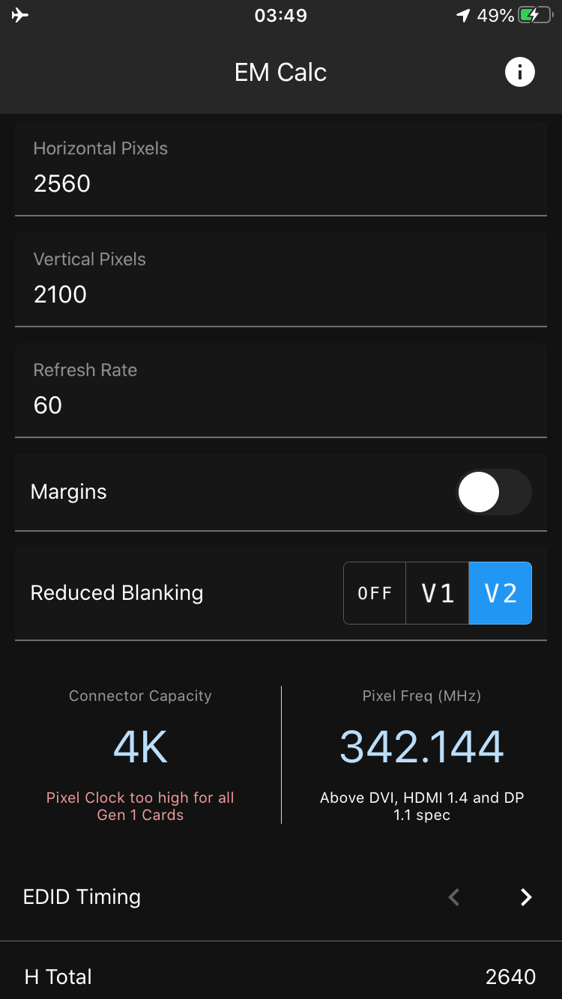
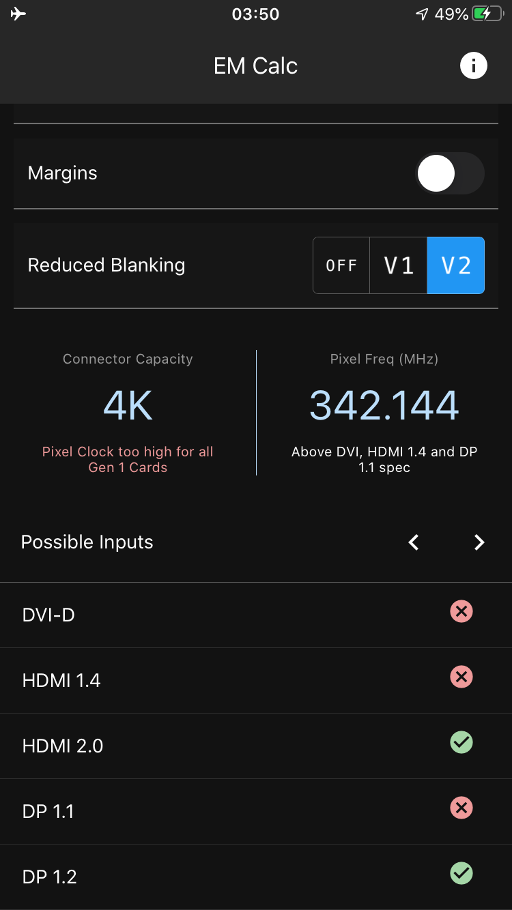
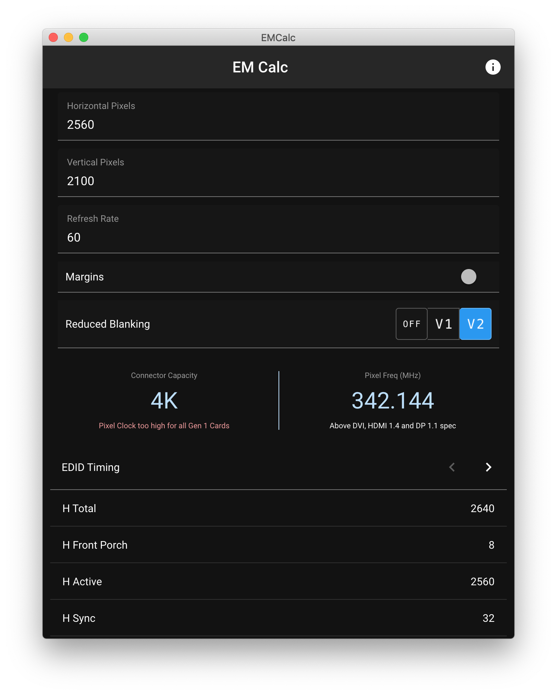

# EM Calc
### Barco Event Master Custom Format Calculator

 |  | 
:---:|:---:|:---:

This tool is designed to help calculate custom formats for the Barco 
Event Master range of products. This isn't a Barco product and 
there's no gaurantee it'll work.

The logic is largely based from the
[spreadsheet](https://www.facebook.com/groups/Barcofolsom/permalink/2524750314238262/)
created by Graham Loveridge, Syed Athar Hussain & Scott Gershick.

Download the latest version for your platform on the 
[releases page](https://github.com/garethnunns/EMCalc/releases)
or use the [web version](https://e2.garethnunns.com).

It's written with [React Native](https://github.com/facebook/react-native) and 
[Expo](https://expo.io/) so native Android and iOS apps could be created if
there's demand, in the mean time, it's a PWA so you can add it to your home
screen and it will still work offline.

Please [open an issue](https://github.com/garethnunns/EMCalc/issues/new)
to report a bug or request a feature.