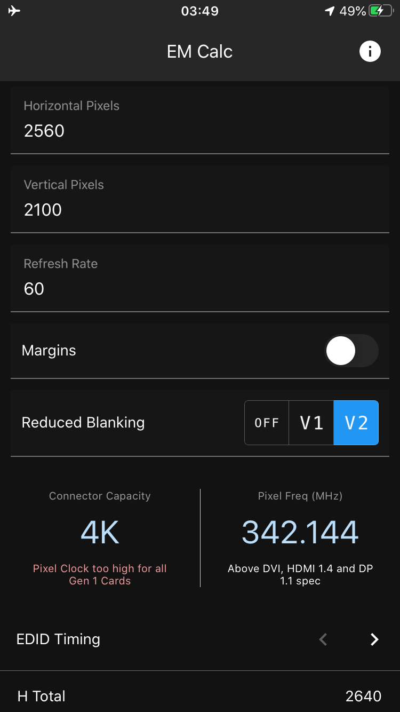
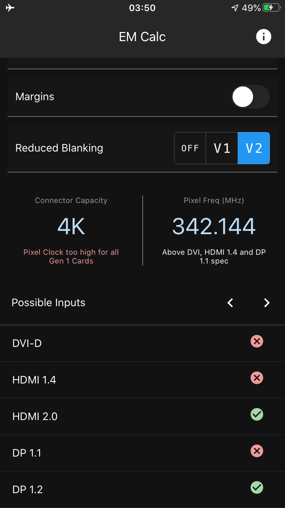
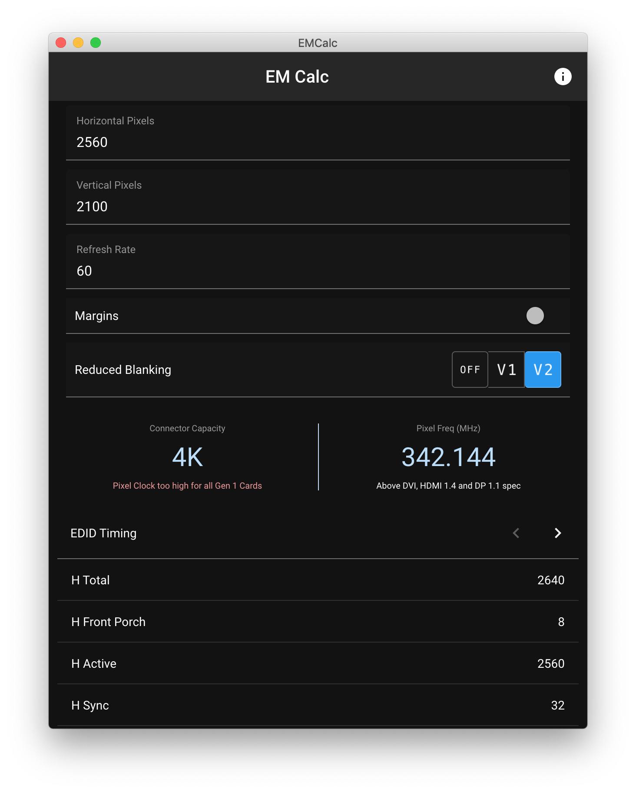

# EM Calc
### Barco Event Master Custom Format Calculator

[](https://github.com/garethnunns/EMCalc/actions/workflows/commit.yml) [](https://github.com/garethnunns/EMCalc/releases/latest) 

 |  | 
:---:|:---:|:---:

This tool is designed to help calculate custom formats for the Barco 
Event Master range of products. This isn't a Barco product and 
there's no gaurantee it'll work.

The logic is largely based from the
[spreadsheet](https://www.facebook.com/groups/Barcofolsom/permalink/2524750314238262/)
created by Graham Loveridge, Syed Athar Hussain & Scott Gershick.

# Run

Download the latest version for your platform on the 
[releases page](https://github.com/garethnunns/EMCalc/releases)
or use the [web version](https://e2.garethnunns.com).

It's written with [React Native](https://github.com/facebook/react-native) and 
[Expo](https://expo.io/) so native Android and iOS apps could be created if
there's demand, in the mean time, it's a PWA so you can add it to your home
screen and it will still work offline.

Please [open an issue](https://github.com/garethnunns/EMCalc/issues/new)
to report a bug or request a feature.

## Build

You'll need [Node.js](https://nodejs.org/) 22 or 24 (see `.nvmrc`) and
[Yarn](https://classic.yarnpkg.com/):

````bash
# clone this repo
git clone https://github.com/garethnunns/EMCalc.git

# go to cloned repo folder
cd EMCalc

# install dependencies
yarn install

# run the Expo dev server (press w for web, i for iOS, a for Android)
yarn start
````

Other scripts:

| Command | Does |
| --- | --- |
| `yarn web` | Run in the browser with live reload |
| `yarn desktop` | Build the web version and open it in Electron |
| `yarn test` | Run the unit tests |
| `yarn build-web` | Export the static website to `web-build/` |
| `yarn build-desktop` | Package the desktop app into `dist/` |
